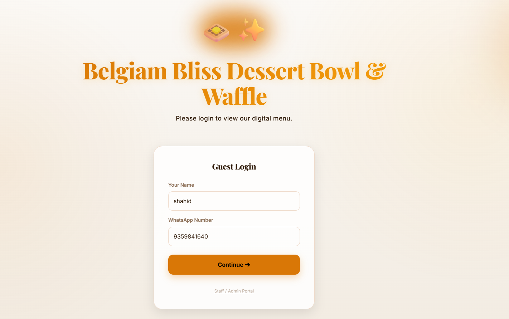
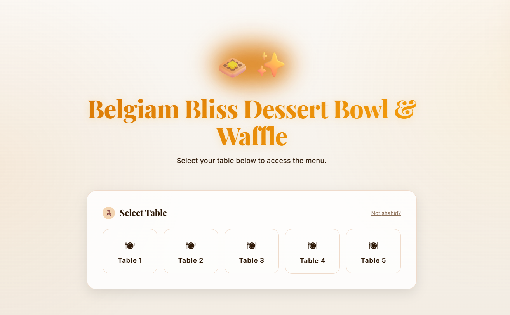
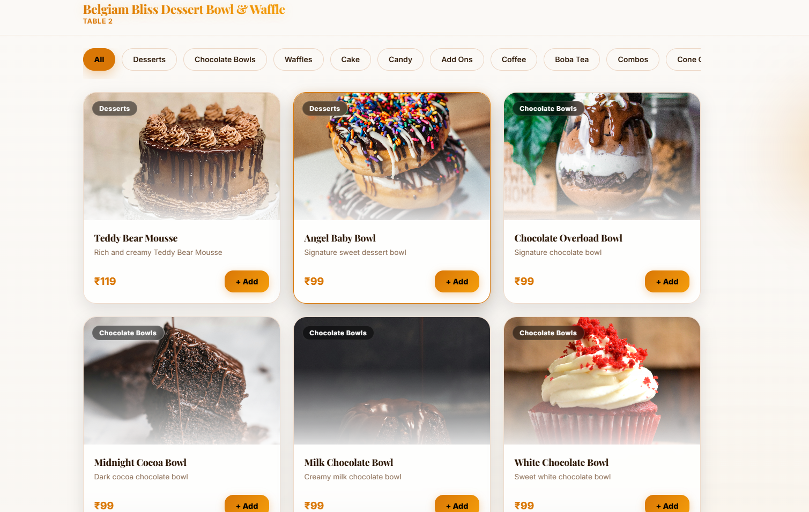
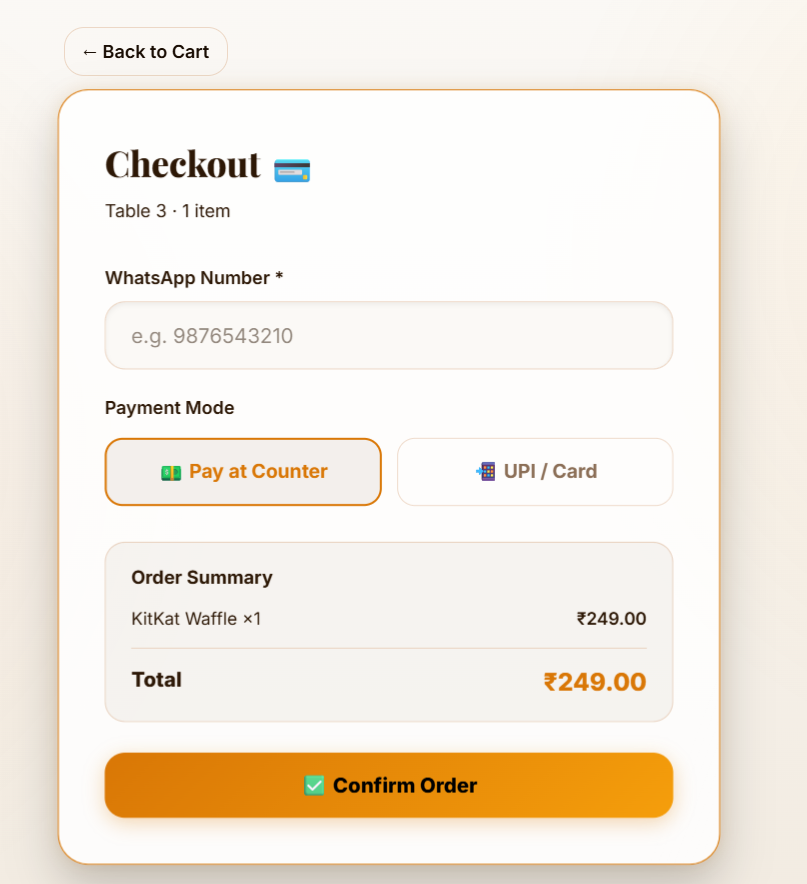
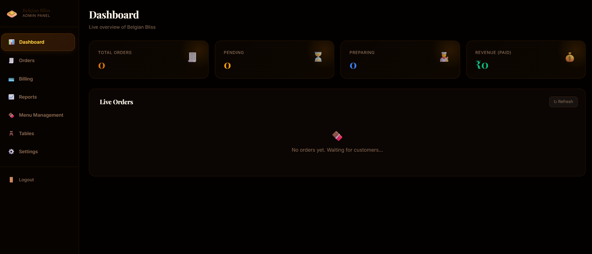

# 🧇 Belgian Bliss - QR Digital Menu & Ordering System

A full-stack, contactless QR-code-based digital menu and ordering system designed for cafes and restaurants. Customers can scan a QR code to view the menu, place orders directly from their tables, or choose a takeaway (parcel) option. The system also includes a robust Admin Panel for live order tracking, billing, menu management, and automated WhatsApp invoices.

---

## 📸 Screenshots

*(Replace the placeholder links below with your actual screenshot paths once you upload them to a `docs` or `assets` folder in your repo)*

### Customer View
<p float="left">
  
  
  
  
</p>

### Admin View
<p float="left">
  
  
</p>

---

## ✨ Features

### 📱 Customer App
- **QR Code Access:** Scan and view the menu dynamically for a specific table.
- **Light/Dark Mode:** Sleek UI with a built-in theme toggler.
- **Live Cart & Checkout:** Real-time cart calculations and checkout options (Cash / Online).
- **WhatsApp Integration:** Provide a phone number to receive WhatsApp invoices.
- **Order Tracking:** Success screen with Order ID and auto-generated digital invoice.

### 💻 Admin Panel
- **Live Dashboard:** Real-time metrics and live incoming orders tracking (Pending, Preparing, Served, Paid).
- **Menu Management:** Add, edit, or delete items and categories dynamically.
- **Billing & Invoices:** View paid orders, download PDF bills, and manually trigger WhatsApp invoices.
- **Analytics & Reports:** Track total revenue, daily revenue, most sold items, and order volume.
- **Settings:** Shop configuration and database wipe functionality (Danger Zone).

---

## 🛠 Tech Stack

- **Frontend:** React.js (v19), Vite, React Router DOM, Context API
- **Styling:** Tailwind CSS, Custom CSS Variables, Framer Motion (Animations)
- **Backend/Database:** Node.js, Express, Supabase (PostgreSQL)
- **Notifications:** Twilio WhatsApp API
- **Tools:** React Hot Toast (Notifications)

---

## 🚀 Installation & Setup Guide

### Prerequisites
Make sure you have the following installed on your system:
- Node.js (v16 or higher)
- Git
- A Supabase Account (for database)
- A Twilio Account (optional, for WhatsApp invoices)

### 1. Clone the Repository
```bash
git clone https://github.com/YOUR_USERNAME/YOUR_REPO_NAME.git
cd dessert-bowl-qr-app
```

### 2. Setup Client (Frontend)
```bash
cd client
npm install
```

Create a `.env` file in the `client` folder:
```env
VITE_SUPABASE_URL=your_supabase_project_url
VITE_SUPABASE_ANON_KEY=your_supabase_anon_key
VITE_BACKEND_URL=http://localhost:5000
```

### 3. Setup Server (Backend)
```bash
cd ../server
npm install
```

Create a `.env` file in the `server` folder:
```env
PORT=5000
SUPABASE_URL=your_supabase_project_url
SUPABASE_SERVICE_ROLE_KEY=your_supabase_service_role_key

# WhatsApp Twilio Config (Optional)
TWILIO_ACCOUNT_SID=your_twilio_sid
TWILIO_AUTH_TOKEN=your_twilio_token
TWILIO_WHATSAPP_NUMBER=whatsapp:+1234567890
```

### 4. Run the Application
You need to start both the client and the server.

**Run Backend (Terminal 1):**
```bash
cd server
npm run dev
```

**Run Frontend (Terminal 2):**
```bash
cd client
npm run dev
```
